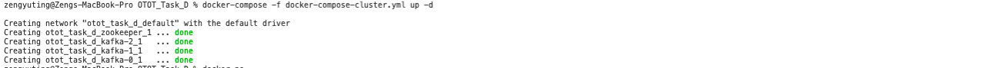
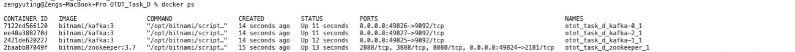
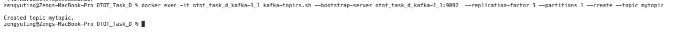
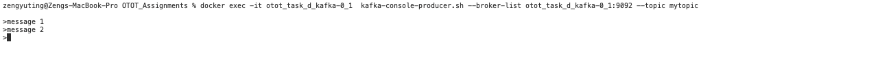
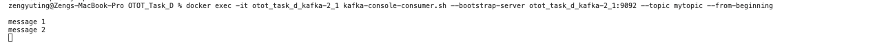
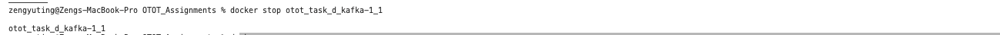
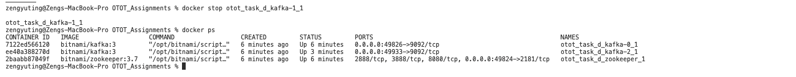
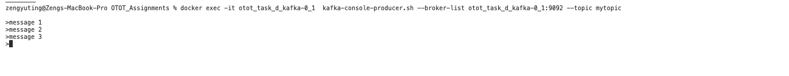
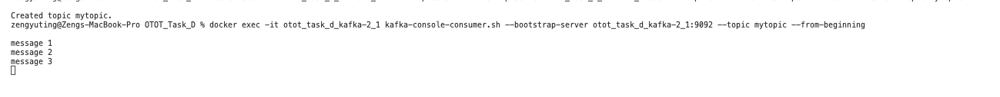

```
Student Name: Zeng Yu Ting
Matriculation Number: A0202284N

Link to github repository: https://github.com/Jillzyt/CS3219/tree/master/OTOT_Task_D
```

Note: Click to view the images on the github readme.md
# Part 1: Pub Sub Messaging system using Apache Kafka

After git-clone this repository,
## Start a three-node Kafka cluster with an additional Zookeeper management node. Verify that the cluster is running with a quick docker ps
    docker-compose -f docker-compose-cluster.yml up -d
 <br>
This should start a three-node Kafka cluster with an additional Zookeeper management node. <br>

## To verify all of your containers are set up.
    docker ps
<br>
<br><br>

## Create a new topic
Create a new topic named mytopic for messages (update the container name as needed for your environment) <br>
    
    docker exec -it otot_task_d_kafka-1_1 kafka-topics.sh --bootstrap-server otot_task_d_kafka-1_1:9092  --replication-factor 3 --partitions 1 --create --topic mytopic
 <br>
<br><br>

## Create a Kafka message consumer
Once the topic has been created, start the Kafka message consumer using one of the nodes. This consumer will connect to the cluster and retrieve and display messages as they are published to the mytopic topic.  <br>
    
    docker exec -it otot_task_d_kafka-2_1 kafka-console-consumer.sh --bootstrap-server otot_task_d_kafka-2_1:9092 --topic mytopic --from-beginning
 <br>
<br><br>

## Create a Kafka message producer 
Log in using a different console and produce some messages on a different node by running the command below and then entering some messages, each on a separate line. <br>
In this case, I typed message 1, enter, typed message 2, enter; <br>
    
    docker exec -it otot_task_d_kafka-0_1  kafka-console-producer.sh --broker-list otot_task_d_kafka-0_1:9092 --topic mytopic
 <br>
<br><br>


# Go back to the other console and you can see that the messages is being passed over
You can see that your messages were sent over
 <br>
<br><br>

# Part 2: Management of failture of the master node in the cluster

## Open another console, kill the node that created the topic with the command below
    docker stop otot_task_d_kafka-1_1
 <br>
<br><br>

## Use docker ps to check the remaining kafka nodes
There should be two nodes remaining
    docker ps
 <br>
<br><br>

## Go back to the console where otot_task_d_kafka-0_1 is opened (Producer), type in another message
I typed in message 3 <br>
 <br>
<br><br>

## Go back to the console where otot_task_d_kafka-2_1 is opened (Consumer), see that you receive the message that you just typed.
You can see message 3 <br>
 <br>
<br><br>


References: <br>
https://engineering.bitnami.com/articles/create-a-pub-sub-messaging-cluster-with-bitnami-s-kafka-and-zookeeper-containers.html <br>
https://blog.clairvoyantsoft.com/kafka-series-3-creating-3-node-kafka-cluster-on-virtual-box-87d5edc85594 <br>
<br>
Default replica count based on the number of brokers<br>
default.replication.factor=3<br>